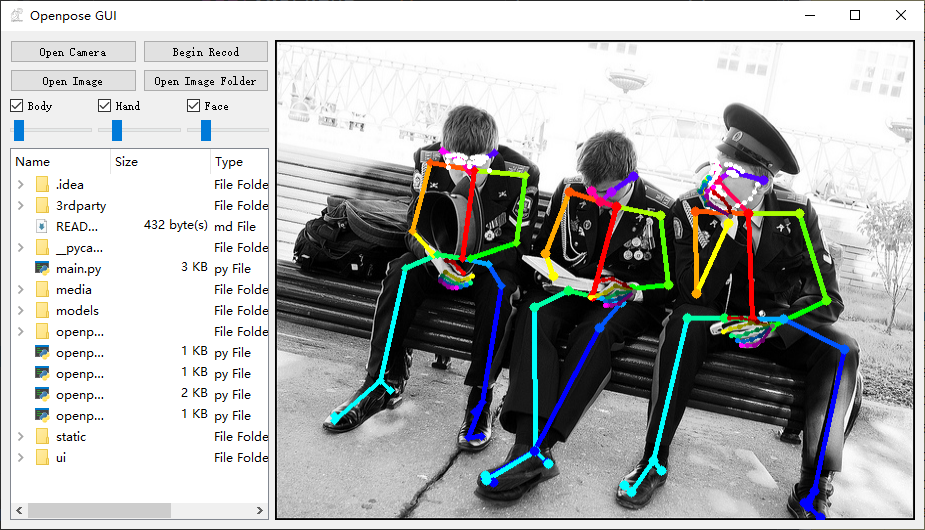

# GUI-for-Pose-Estimate-and-Action-Recognition

## Introduction

* This is a GUI program for pose estimation and action recognition based on [Openpose](https://github.com/CMU-Perceptual-Computing-Lab/openpose).
* You can visualize key-points on image or camera and save the key-points data(as npy format) at the same time.
* You can train a deep learning model for action ( or gesture or emotion) recognition through the data collected from this program.
* My platform is windows10. I have complied the openpose with the python api and the complied binary files will be given below. So you don't have to compile the openpose from scratch

## Python Dependence
* numpy==1.14.2
* PyQt5==5.11.3
* opencv-python==4.1.0.25
* torch==1.0.1(only for training and recognition)

## Installation
- Install [cuda10](https://developer.nvidia.com/cuda-downloads) and [cudnn7]. Or here is my [BaiduDisk](https://pan.baidu.com/s/1EcVfsA7R4dIkj8kJqc9K9g)  password：`4685`.

- Run `models/getModels.bat` to get model. Or here is my [BaiduDisk](https://pan.baidu.com/s/14SV-v8CXRPMVoMvPoB2Haw)  password：`rmkn` and put models in the corresponding position.

    

- Download 3rd-party dlls from my [BaiduDisk](https://pan.baidu.com/s/1Cco38Py2G70s559qDt_g6g) password：`64sg` and unzip in your 3rdparty folder.

## Usage

1.  First, you should select which kind of key-points do you want to visualize or collect by checking the checkbox(`Body`, `Hand`, `Face`).

2. Click `Open webcam` for running on your local camera or double click image file in the directory tree for running on a single image. Your can also change the current folder by click `Alter Folder`

3. The threshold of three model can be controled by draging corresponding slider.

4. Click `Save Result` for saving the current frame and the key-points that you have selected. 

5. You will get a output folder like the following figure. The count is set to 0 when the program begins and will automatically increase with the number of images saved.

   

   

6. The key-points is saved as ndarray and you can read the data using code like `np.load('0001_body.npy')`to get the data. Take body key-points for instance, it is a array with shape of `n x 25 x 3​`, here n means the number of person, 25 means 25 key-points on one person and 3 means `(x, y, score)`
7. The function of `gesture recognition` can only be used when the hand checkbox is on. My model is only a 2 layers MLP, and the data was collected with front camera and left hand. So it may have many limitations. Your can train your own model and replace it.

## References
[Openpose](https://github.com/CMU-Perceptual-Computing-Lab/openpose)
