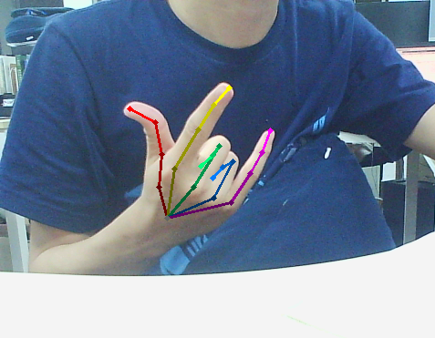

# Openpose-python-cuda10-windows
1. Release of python api of openpose in windows using cuda10 and cudnn7.
2. GUI for easy use
3. Get keypoints from image to local file(TODO)

## Installation
1. install cuda10
2. install cudnn7
3. run `models/getModels.bat` to get model
4. run `pip install opencv-python` to install opencv in python
6. run `python openpose_python.py` for run in command line
6. run `python main.py` for run with gui

## example
* GUI       

* image     

## References
[Openpose](https://github.com/CMU-Perceptual-Computing-Lab/openpose)
