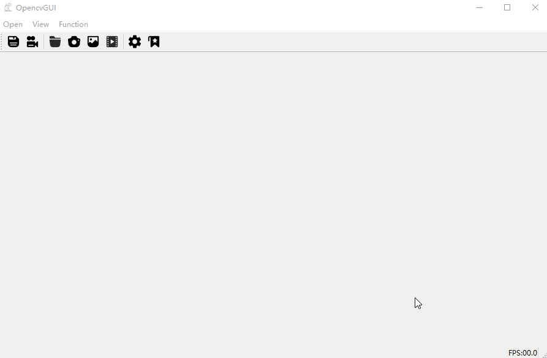
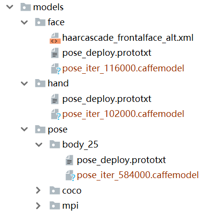
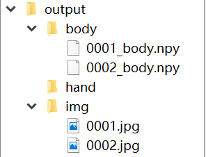

# GUI-for-Pose-Estimate-and-Action-Recognition


## Introduction

* This is a GUI program for pose estimation and action recognition based on [Openpose](https://github.com/CMU-Perceptual-Computing-Lab/openpose).
* You can visualize key-points on image or camera and save the key-points data(as npy format) at the same time.
* You can train a deep learning model for action ( or gesture or emotion) recognition through the data collected from this program.
* My platform is windows10. I have complied the openpose with the python api and the complied binary files will be given below. So you don't have to compile the openpose from scratch

## Python Dependence
* numpy==1.14.2
* PyQt5==5.11.3
* opencv-python==4.1.0.25
* torch==1.0.1(only for gesture recognition)

## Installation
- Install [cuda10](https://developer.nvidia.com/cuda-downloads) and [cudnn7]. Or here is my [BaiduDisk](https://pan.baidu.com/s/1EcVfsA7R4dIkj8kJqc9K9g)  password：`4685`.

- Run `models/getModels.bat` to get model. Or here is my [BaiduDisk](https://pan.baidu.com/s/14SV-v8CXRPMVoMvPoB2Haw)  password：`rmkn` and put models in the corresponding position
  
    
    
- Download 3rd-party dlls from my [BaiduDisk](https://pan.baidu.com/s/1Cco38Py2G70s559qDt_g6g) password：`64sg` and unzip in your 3rdparty folder.

## Usage
1.  : save current result
2.  : save result every interval while  camera or video is opening
6.  : open camera
7.  : show setting view
8.  : show file-tree view

## Setting
1. First, you should select which kind of key-points do you want to visualize or collect by checking the checkbox(`Body`, `Hand`, `Face`).
2. The threshold of three model can be controled by draging corresponding slider.
3. Change save interval.
4. Change net resolution for smaller GPU memery, but it will  reduce the accuracy.
5. The function of `gesture recognition` can only be used when the hand checkbox is on. My model is only a 2 layers MLP, and the data was collected with front camera and left hand. So it may have many limitations. Your can train your own model and replace it.

## TODO

* action recognition

* emotion recognition

## Data format
You will get a output folder like the following figure. The count is set to 0 when the program begins and will automatically increase with the number of images saved.

```python
data_body = np.load('body/0001_body.npy')
data_hand = np.load('hand/0001_hand.npy')
data_face = np.load('face/0001_face.npy')
print(data_body.shape)  
# (1, 25, 3)  : person_num x kep_points_num x x_y_scroe
print(data_hand.shape)  
# (2, 1, 21, 3)  : left_right x person_num x kep_points_num x x_y_scroe
print(data_face.shape) 
# (1, 70, 3)  : person_num x kep_points_num x x_y_scroe
```

## Train your own model
1. Collect data and make folder for every class.

   

2. run `python train.py -p C:\Users\Administrator\Desktop\自建数据集\hand` to train your model(replace path with your dataset path)

## References
[Openpose](https://github.com/CMU-Perceptual-Computing-Lab/openpose)
